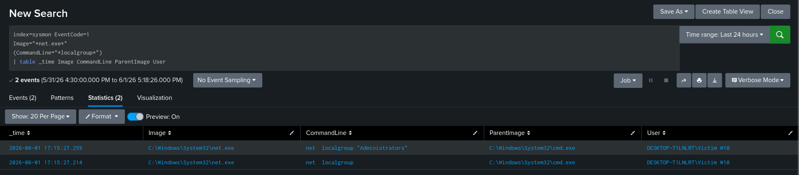
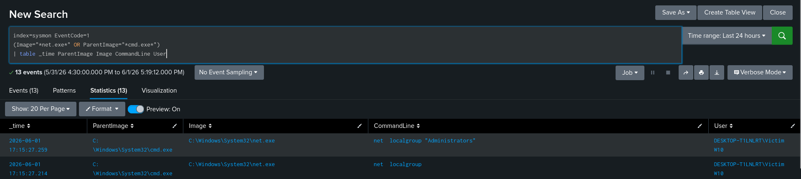
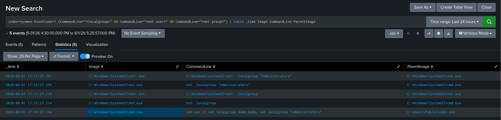
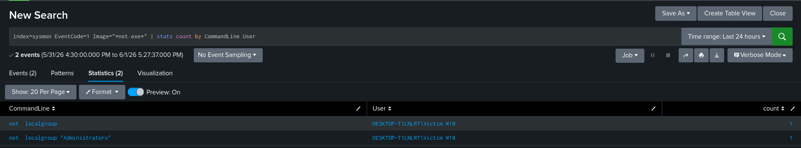
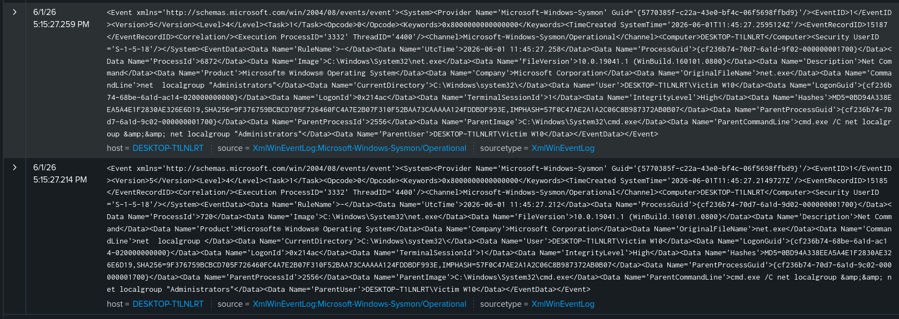
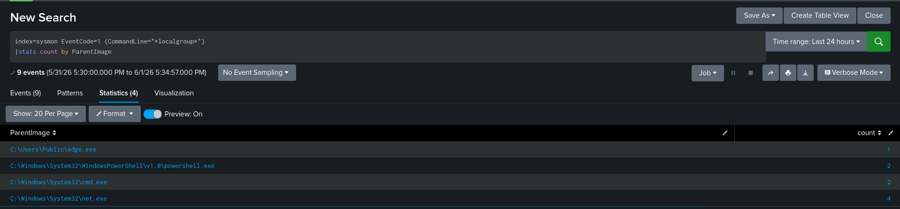
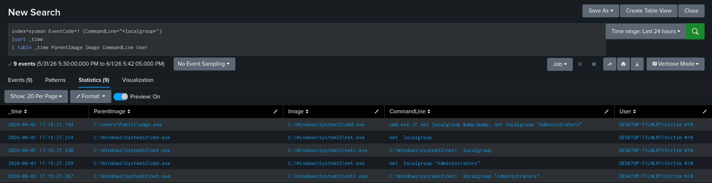
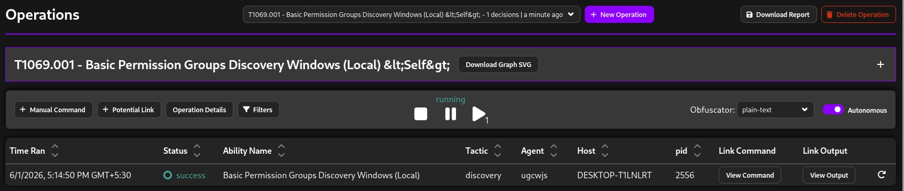
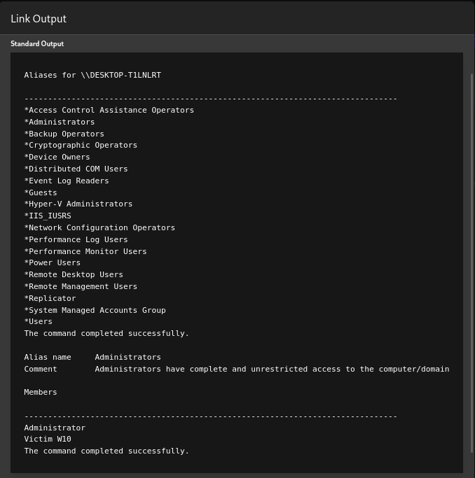
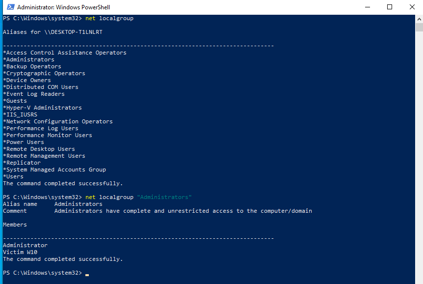

# T1069.001 - Local Group Discovery

## Executive Summary

This report documents the simulation, investigation, and detection of MITRE ATT&CK technique T1069.001 (Permission Groups Discovery: Local Groups) using MITRE Caldera.

The activity was executed through a Sandcat agent deployed on a Windows 10 endpoint. The adversary emulation leveraged the native Windows utility `net.exe` to enumerate local security groups and identify members of the local Administrators group.

The generated telemetry was collected and analyzed using:

- Sysmon
- Splunk Enterprise
- MITRE Caldera

The investigation successfully identified:

- Local group enumeration activity
- Administrator group membership discovery
- Complete process execution chain
- ATT&CK-aligned reconnaissance behavior
- Detection opportunities using Sysmon Event ID 1 telemetry

---

# ATT&CK Technique Information

| Field | Value |
|--------|--------|
| Technique ID | T1069.001 |
| Technique Name | Permission Groups Discovery: Local Groups |
| ATT&CK Tactic | Discovery |
| Platform | Windows |

---

# Threat Context

Adversaries commonly enumerate local groups to understand:

- Privileged users
- Administrative access
- Available security groups
- Potential privilege escalation paths

This reconnaissance activity is frequently observed during:

- Initial access validation
- Post-exploitation reconnaissance
- Privilege escalation preparation
- Lateral movement planning

Understanding which accounts belong to privileged groups enables attackers to prioritize targets and identify high-value credentials.

---

# Lab Environment

| Component | Purpose |
|------------|------------|
| Windows 10 | Target Endpoint |
| Sysmon | Endpoint Telemetry |
| Splunk Enterprise | SIEM Platform |
| MITRE Caldera | Adversary Emulation |
| Sandcat Agent | Command Execution |

---

# Attack Simulation

## Adversary Emulation Tool

MITRE Caldera

Plugins Used:

- Stockpile
- Sandcat

---

## Ability Executed

```cmd
net localgroup && net localgroup "Administrators"
```

---

## Attack Objective

The objective of this technique was to enumerate:

- Local security groups
- Administrative groups
- Group memberships
- Privileged accounts

---

# Attack Execution Timeline

| Time (IST) | Activity |
|------------|------------|
| 17:14:50 | Caldera operation initiated |
| 17:15:27 | Sandcat executed discovery ability |
| 17:15:27 | cmd.exe launched |
| 17:15:27 | net.exe executed |
| 17:15:27 | net1.exe executed |
| 17:15:27 | Local groups enumerated |
| 17:15:27 | Administrator group membership discovered |
| 17:15:27 | Telemetry ingested into Splunk |

---

# Attack Output

## Enumerated Local Groups

The following local groups were identified:

- Administrators
- Backup Operators
- Guests
- Users
- Remote Desktop Users
- Hyper-V Administrators
- Event Log Readers
- IIS_IUSRS
- Remote Management Users

---

## Administrator Group Membership

The attack identified the following members of the local Administrators group:

```text
Administrator
Victim W10
```

---

# Telemetry Generated

The attack generated valuable process creation telemetry.

---

## Sysmon Telemetry

### Event ID 1 – Process Creation

Observed Processes:

```text
edge.exe
→ cmd.exe
→ net.exe
→ net1.exe
```

The telemetry included:

- Image
- ParentImage
- CommandLine
- User
- ProcessGuid
- ProcessId

---

# Telemetry Observations

The generated telemetry provided complete visibility into the execution chain.

Key observations:

- Sandcat executed through edge.exe
- edge.exe spawned cmd.exe
- cmd.exe spawned net.exe
- net.exe spawned net1.exe
- Command-line arguments were fully preserved
- Parent-child relationships remained intact
- Splunk successfully ingested all relevant telemetry

The visibility provided by Sysmon Event ID 1 enabled straightforward ATT&CK mapping and investigation.

---

# Investigation Methodology

The investigation focused on:

- Process creation analysis
- Command-line auditing
- Parent-child process relationships
- Discovery activity correlation
- ATT&CK technique mapping

---

# Splunk Investigation Queries

# 1. Local Group Discovery Detection

## SPL Query

```spl
index=sysmon EventCode=1
Image="*net.exe*"
(CommandLine="*localgroup*")
| table _time Image CommandLine ParentImage User
```

## Investigation Purpose

This query identifies:

- Local group enumeration
- Administrative group discovery
- Permission group reconnaissance

## Findings

The query confirmed:

```text
net localgroup
net localgroup "Administrators"
```

Both commands were successfully executed and captured by Sysmon.

## Evidence



---

# 2. Process Tree Analysis

## SPL Query

```spl
index=sysmon EventCode=1
(Image="*net.exe*" OR ParentImage="*cmd.exe*")
| table _time ParentImage Image CommandLine User
```

## Investigation Purpose

This query reconstructs the process lineage associated with the discovery activity.


## Findings

The telemetry confirmed:

```text
cmd.exe
→ net.exe
```

This process chain aligns with expected Windows local group enumeration behavior.

---

## Evidence



---

# 3. Discovery Activity Hunting

## SPL Query

```spl
index=sysmon EventCode=1
(CommandLine="*localgroup*" OR CommandLine="*net user*" OR CommandLine="*net group*")
| table _time Image CommandLine ParentImage
```

## Investigation Purpose

This query hunts for broader account and permission discovery activity.


## Findings

The query successfully identified local group enumeration activity performed during the adversary simulation.


## Evidence



---

# 4. Statistical Analysis

## SPL Query

```spl
index=sysmon EventCode=1
Image="*net.exe*"
| stats count by CommandLine User
```

## Investigation Purpose

This query summarizes execution frequency and command usage.


## Findings

Two distinct commands were identified:

```text
net localgroup
net localgroup "Administrators"
```

Both commands executed successfully under the same user context.


## Evidence



---

# 5. Raw Telemetry Validation

## Sysmon Event Validation

Raw Event ID 1 telemetry confirmed:

- Process Name: net.exe
- Parent Process: cmd.exe
- User: Victim W10
- CommandLine:
  - net localgroup
  - net localgroup "Administrators"

---

## Evidence



---

# 6. Parent Process Analysis

## SPL Query

```spl
index=sysmon EventCode=1
(CommandLine="*localgroup*")
| stats count by ParentImage
```

---

## Findings

The investigation identified multiple execution contexts:

| Parent Process | Observation |
|----------------|-------------|
| edge.exe | Sandcat Agent Execution |
| cmd.exe | Command Interpreter |
| net.exe | Native Windows Behavior |
| powershell.exe | Analyst Validation Activity |

---

## Analyst Note

Additional PowerShell-generated events were observed during evidence collection and validation activities performed after the attack execution.

These events were generated manually by the analyst to verify output consistency and should not be considered part of the original adversary activity.

---

## Evidence



---

# Detection Logic Summary

The detection strategy focused on identifying local group enumeration through monitoring of:

- net.exe execution
- localgroup command arguments
- parent-child process relationships
- privilege reconnaissance behavior

Primary telemetry source:

- Sysmon Event ID 1

---

## Potential False Positives

Legitimate activity may originate from:

- System administrators
- Helpdesk personnel
- Asset inventory scripts
- Compliance auditing tools
- Endpoint management solutions

Analysts should validate:

- User context
- Parent process lineage
- Execution frequency
- Surrounding activity

---

# Severity Assessment

| Category | Assessment |
|------------|------------|
| ATT&CK Tactic | Discovery |
| Risk Level | Medium |
| Detection Confidence | High |
| Telemetry Visibility | High |

---

## Analyst Assessment

The observed activity represents reconnaissance behavior frequently performed during the early stages of an intrusion.

While local group enumeration is not inherently malicious, repeated discovery activity combined with additional ATT&CK techniques may indicate active adversary reconnaissance.

Early detection provides defenders with opportunities to identify malicious behavior before privilege escalation or lateral movement occurs.

---

# ATT&CK Mapping

| ATT&CK ID | Technique |
|------------|------------|
| T1069.001 | Permission Groups Discovery: Local Groups |

---

# Detection Outcome

| Detection Area | Result |
|----------------|------------|
| Local Group Discovery Detection | Successful |
| Command-Line Visibility | Successful |
| Process Lineage Reconstruction | Successful |
| Splunk Telemetry Ingestion | Successful |
| ATT&CK Mapping | Successful |

---

# Investigation Findings

The investigation confirmed that MITRE Caldera successfully executed local group discovery activity using native Windows utilities.

Key findings:

- Local security groups were enumerated
- Administrator group membership was identified
- Complete process lineage was reconstructed
- Command-line visibility was preserved
- ATT&CK mapping was successfully performed
- Detection opportunities were validated through Sysmon telemetry

The observed execution chain:

```text
edge.exe
→ cmd.exe
→ net.exe
→ net1.exe
```


provided high-confidence evidence of discovery activity.

---

# Screenshots

| Screenshot | Purpose |
|:----------:|:--------|
|  | Successful adversary execution |
|  | Command output collected by attacker |
|  | Output from powershell to compare output collected from caldera |
|  | Primary detection evidence |
|  | Process lineage investigation |
|  | Discovery hunting workflow |
|  | Statistical analysis |
|  | Raw telemetry validation |
|  | Parent process investigation |

---

# References

## MITRE ATT&CK

- https://attack.mitre.org/techniques/T1069/001/

---


# Conclusion

This investigation successfully demonstrated how adversaries may abuse native Windows utilities to enumerate local security groups and identify privileged accounts.

The attack generated high-quality telemetry through Sysmon Event ID 1, enabling:

- Process creation visibility
- Command-line auditing
- Process lineage reconstruction
- ATT&CK-aligned detection development

The investigation validated that Splunk and Sysmon provide strong visibility into local group discovery activity and can effectively support SOC investigations involving privilege reconnaissance techniques.