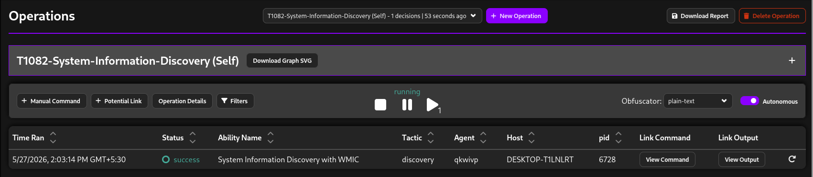
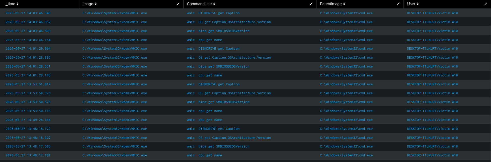
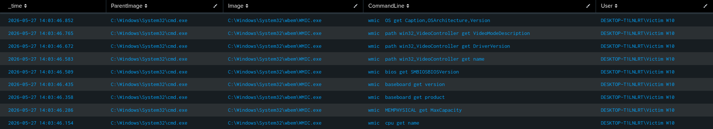
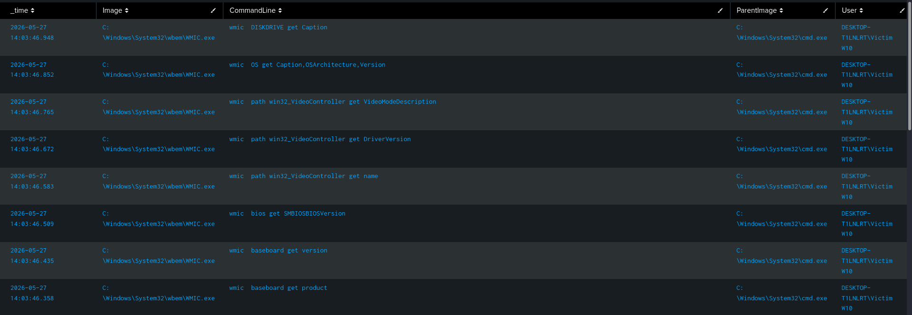
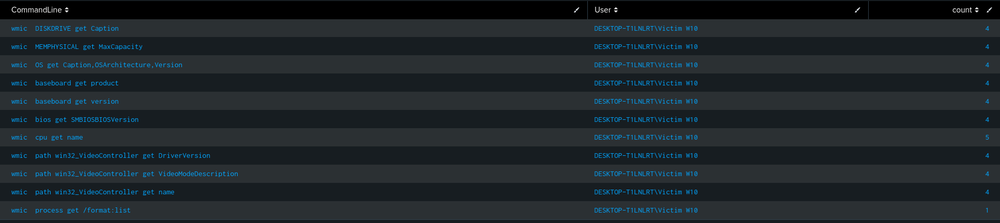
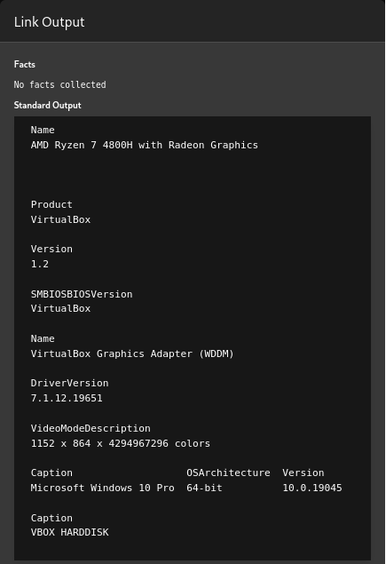
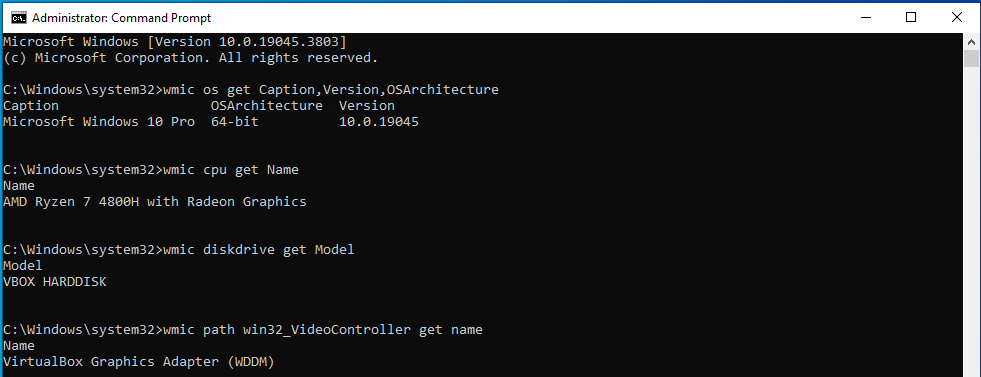

# T1082 - System Information Discovery

## Executive Summary

This report documents the simulation and investigation of MITRE ATT&CK technique T1082 (System Information Discovery) using the Windows Management Instrumentation Command-line (WMIC) utility.

The activity was executed through MITRE Caldera adversary emulation to simulate realistic attacker reconnaissance behavior commonly observed during the discovery phase of intrusions.

The generated telemetry was collected using:
- Sysmon
- PowerShell Logging
- Splunk SIEM

The attack successfully produced:
- process creation telemetry
- command-line artifacts
- parent-child process relationships
- Windows reconnaissance evidence

Detection logic was developed in Splunk to identify suspicious WMIC-based discovery activity.

---

# ATT&CK Technique Information

| Field | Value |
|---|---|
| Technique ID | T1082 |
| Technique Name | System Information Discovery |
| ATT&CK Tactic | Discovery |
| Related Technique | T1047 - Windows Management Instrumentation |

---

# Threat Context

Adversaries commonly perform system information discovery to gather:
- operating system details
- CPU information
- disk information
- architecture information
- hardware inventory

This information assists attackers in:
- payload selection
- privilege escalation planning
- environment awareness
- defensive evasion planning

WMIC-based reconnaissance has been publicly associated with:
- Aurora Stealer
- commodity malware
- post-exploitation frameworks
- red team operations

---

# Lab Environment

| Component | Purpose |
|---|---|
| Kali Linux | Splunk + MITRE Caldera |
| Windows 10 | Target endpoint |
| Sysmon | Endpoint telemetry |
| Splunk Enterprise | SIEM platform |
| MITRE Caldera | Adversary emulation |

---

# Attack Simulation

## Adversary Emulation Tool

MITRE Caldera

Plugin:
- Stockpile
- Sandcat

---

# Attack Objective

The objective of the attack was to enumerate:
- operating system details
- CPU information
- disk information
- GPU information

using native Windows utilities.

---

# Commands Executed

## Operating System Enumeration

```cmd
wmic os get Caption,Version,OSArchitecture
Caption                   OSArchitecture  Version
Microsoft Windows 10 Pro  64-bit          10.0.19045
```

---

## CPU Enumeration

```cmd
wmic cpu get Name
Name
AMD Ryzen 7 4800H with Radeon Graphics
```

---

## Disk Enumeration

```cmd
wmic diskdrive get Model
Model
VBOX HARDDISK
```

---

## GPU Enumeration

```cmd
wmic path win32_VideoController get name
Name
VirtualBox Graphics Adapter (WDDM)
```

---
## Caldera Operation Status



---

# Telemetry Generated

The attack generated telemetry across multiple logging sources.

---

## Sysmon Telemetry

### Event ID 1 - Process Creation

Generated by:
- cmd.exe
- wmic.exe

Telemetry Included:
- Image
- CommandLine
- ParentImage
- User
- ProcessId

---

## PowerShell Logging

PowerShell logging may also capture:
- script execution
- command execution context
- WMIC execution wrappers

depending on execution method.

---
# Telemetry Observations

The attack generated highly valuable process execution telemetry through Sysmon.

Key observations:
- WMIC command-line arguments were fully visible
- parent-child relationships were preserved
- multiple discovery commands were successfully logged
- telemetry ingestion into Splunk occurred without parsing issues

The collected telemetry provided sufficient visibility to:
- identify attacker discovery behavior
- reconstruct execution chains
- perform ATT&CK mapping
- build detection logic

# Investigation Methodology

The investigation focused on:
- process execution visibility
- WMIC command-line arguments
- parent-child process relationships
- attacker discovery behavior

---

# Splunk Investigation Queries

# 1. WMIC Process Creation Detection

## SPL Query

```spl
index=sysmon EventCode=1
Image="*wmic.exe*"
(CommandLine="*os get*" OR CommandLine="*cpu get*" OR CommandLine="*diskdrive get*" OR CommandLine="*VideoController*")
| table _time Image CommandLine ParentImage User
```

---

## Investigation Purpose

This query identifies:
- WMIC execution activity
- system discovery commands
- attacker reconnaissance behavior

The query filters for:
- operating system enumeration
- hardware discovery
- disk enumeration
- GPU enumeration

---

## Important Investigation Fields

| Field | Purpose |
|---|---|
| Image | Executed binary |
| CommandLine | Executed discovery command |
| ParentImage | Parent process |
| User | Execution context |
| _time | Event timeline |

---

# 2. Parent-Child Process Investigation

## SPL Query

```spl
index=sysmon EventCode=1
(Image="*wmic.exe*" OR ParentImage="*cmd.exe*")
| table _time Image ParentImage CommandLine User
```

---

## Investigation Purpose

This query assists in:
- process tree analysis
- execution chain investigation
- identifying attacker execution flow

The telemetry demonstrates:
- cmd.exe spawning wmic.exe
- discovery command execution
- attacker process lineage

---

# 3. Broad Discovery Activity Hunting

## SPL Query

```spl
index=sysmon EventCode=1
(CommandLine="*wmic*" OR CommandLine="*systeminfo*" OR CommandLine="*hostname*")
| table _time Image CommandLine ParentImage User
```

---

## Investigation Purpose

This query is useful during:
- enterprise threat hunting
- discovery activity correlation
- reconnaissance investigations

It helps identify:
- common discovery utilities
- attacker reconnaissance patterns
- suspicious administrative behavior

---

# Detection Engineering Analysis

## Why WMIC Is Important

WMIC is considered a Living-Off-the-Land Binary (LOLBIN).

Attackers abuse WMIC because:
- it is signed by Microsoft
- commonly present on Windows systems
- often trusted by security controls
- capable of extensive system enumeration

---

# Detection Opportunities

## High-Value Detection Areas

### Suspicious WMIC Usage
- abnormal WMIC execution
- discovery-related command arguments
- WMIC launched from unusual parent processes

---

### Discovery Activity Correlation
- repeated enumeration activity
- multiple discovery commands in short intervals
- chained reconnaissance behavior

---

### Parent-Child Process Relationships
- powershell.exe spawning cmd.exe
- cmd.exe spawning wmic.exe
- Office applications spawning WMIC

---

# Detection Logic Summary

The detection strategy focused on identifying suspicious WMIC execution associated with discovery activity.

Primary telemetry source:
- Sysmon Event ID 1 (Process Creation)

Detection coverage included:
- WMIC process execution
- hardware enumeration commands
- operating system discovery
- parent-child process relationships

The investigation relied heavily on:
- command-line auditing
- process lineage analysis
- LOLBin monitoring

---

## Potential False Positives

Legitimate administrative activity may generate similar telemetry.

Examples include:
- system inventory scripts
- IT asset management tools
- hardware diagnostics
- administrative troubleshooting

Analysts should validate:
- execution context
- user activity
- parent process lineage
- execution frequency

# Investigation Findings

The attack successfully generated:
- Sysmon Event ID 1 telemetry
- WMIC command-line visibility
- process execution evidence
- parent-child process relationships

The telemetry confirmed:
- Sysmon logging functionality
- successful Splunk ingestion
- effective detection query visibility
- ATT&CK-aligned discovery activity

The investigation demonstrated that:
- WMIC-based reconnaissance is highly visible through Sysmon
- command-line logging significantly improves detection capability
- process lineage analysis provides strong investigative value

---

# ATT&CK Mapping

| ATT&CK ID | Technique |
|---|---|
| T1082 | System Information Discovery |
| T1047 | Windows Management Instrumentation |

---

# SOC Analyst Investigation Notes

## Initial Indicators

The following indicators may suggest suspicious discovery activity:
- unusual WMIC execution
- repeated hardware enumeration
- discovery commands executed by non-administrative users
- WMIC launched by scripting engines

---

## Recommended Analyst Actions

### Validate Parent Process
Determine:
- what launched WMIC
- whether the parent process is legitimate

---

### Review Command-Line Arguments
Investigate:
- operating system discovery
- hardware enumeration
- disk information collection

---

### Correlate With Additional Discovery Activity
Review for:
- hostname enumeration
- local group discovery
- process discovery
- network discovery

---

### Review User Context
Determine:
- whether execution context is expected
- whether activity aligns with administrative behavior

---

# Screenshots

## 1. WMIC Process Creation Detection


### Found 
ParentImage - cmd.exe
Image - WMIC.exe
CommandLine - multiple hardware enumeration commands

---

## 2. Process Tree Investigation


### Found
Parent (cmd.exe) - Child process (WMIC.exe) 

---

## 3. Caldera Operation Execution


Attack Completion Status - Success

---

## 4. SPL Detection Query



### Found
Total number of times unique WMIC.exe executed commands
---

## 5. WMIC Discovery Output





---

# Evidence Collection

## Primary Telemetry Sources

| Source | Purpose |
|---|---|
| Sysmon Event ID 1 | Process execution |
| Splunk | Centralized investigation |
| Caldera | Adversary emulation evidence |

---

# Severity Assessment

| Category | Assessment |
|---|---|
| ATT&CK Tactic | Discovery |
| Risk Level | Medium |
| Detection Confidence | High |
| Telemetry Visibility | High |

---

## Analyst Assessment

The observed activity represents reconnaissance behavior commonly performed during early attack stages.

While WMIC execution alone is not inherently malicious, the activity becomes suspicious when:
- executed unexpectedly
- chained with additional discovery activity
- launched by scripting engines
- associated with unauthorized users

Early detection of reconnaissance activity provides defenders with opportunities to identify adversary behavior before lateral movement or privilege escalation occurs.

---

# Conclusion

This attack simulation successfully demonstrated how adversaries may abuse WMIC for system information discovery.

The generated telemetry provided:
- strong process visibility
- command-line auditing
- parent-child process relationships
- ATT&CK-aligned detection opportunities

The investigation confirmed that Sysmon combined with Splunk provides highly effective visibility into WMIC-based reconnaissance activity commonly observed during adversary discovery phases.

---

# References

## MITRE ATT&CK

- https://attack.mitre.org/techniques/T1082/
- https://attack.mitre.org/techniques/T1047/

---

## Threat Intelligence References

- https://blog.sekoia.io/aurora-a-rising-stealer-flying-under-the-radar/
- https://blog.cyble.com/2023/01/18/aurora-a-stealer-using-shapeshifting-tactics/

---

## WMIC Enumeration Reference

- https://nwgat.ninja/getting-system-information-with-wmic-on-windows/