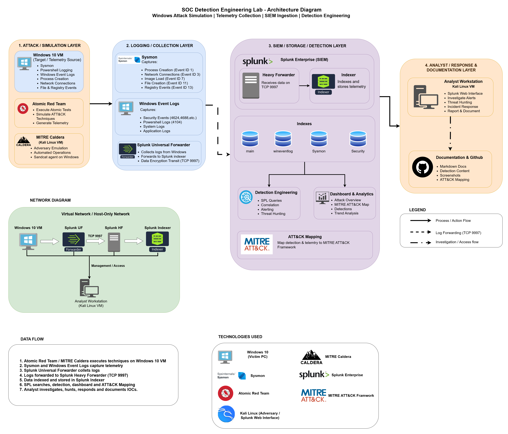

# SOC Detection Engineering Lab Architecture



---

# Overview

This project was built to simulate a real-world Security Operations Center (SOC) environment focused on adversary emulation, telemetry collection, threat hunting, detection engineering, and MITRE ATT&CK mapping.

The objective of the lab is to generate realistic attack telemetry using adversary simulation frameworks and then investigate, detect, and document the resulting activity using Splunk SIEM.

The environment follows a layered architecture similar to enterprise security operations workflows:

1. Attack Simulation Layer
2. Logging & Telemetry Collection Layer
3. SIEM & Detection Layer
4. Analyst Investigation & Documentation Layer

---

# Architecture Overview

The lab consists of a Windows 10 endpoint generating telemetry, a Splunk deployment for centralized log collection and analysis, and adversary emulation tools used to simulate real-world attack techniques.

The architecture enables:

- ATT&CK-aligned attack simulations
- Endpoint telemetry collection
- Centralized log analysis
- Detection engineering
- Threat hunting
- Incident investigation
- ATT&CK mapping
- SOC-style reporting

---

# Layer 1 – Attack Simulation Layer

The attack simulation layer is responsible for generating realistic adversary activity on the Windows endpoint.

## Windows 10 Endpoint

The Windows 10 virtual machine serves as the primary target system.

### Purpose

- Victim workstation
- Telemetry generation source
- Sandcat agent execution
- Atomic Red Team execution
- ATT&CK technique simulation

### Telemetry Generated

- Sysmon Events
- Windows Security Events
- PowerShell Logging
- Process Creation Events
- Network Connection Events
- Registry Events
- File Creation Events

---

## MITRE Caldera

MITRE Caldera is used as the primary adversary emulation platform.

### Purpose

- Automated attack execution
- ATT&CK technique simulation
- Adversary emulation
- Process chain generation
- Detection validation

### Components Used

- Stockpile Plugin
- Sandcat Agent

### Example Techniques Simulated

- T1082 – System Information Discovery
- T1069.001 – Local Group Discovery
- T1057 – Process Discovery

---

## Atomic Red Team

Atomic Red Team is used to execute individual ATT&CK techniques in a controlled manner.

### Purpose

- Detection validation
- Technique-specific testing
- Telemetry generation
- ATT&CK coverage testing

### Benefits

- Repeatable attack simulations
- Safe testing environment
- Standardized ATT&CK execution

---

# Layer 2 – Logging & Telemetry Collection Layer

This layer collects endpoint activity and transforms it into searchable security telemetry.

---

## Sysmon

Sysmon (configured using:- swiftonsecurity sysmon) provides detailed endpoint visibility beyond native Windows logging.

### Key Event IDs

| Event ID | Description |
|-----------|-------------|
| 1 | Process Creation |
| 3 | Network Connections |
| 7 | Image Load |
| 11 | File Creation |
| 13 | Registry Value Set |

### Purpose

- Process monitoring
- Command-line visibility
- Process lineage analysis
- Threat hunting telemetry

---

## Windows Event Logs

Native Windows logs provide additional visibility into operating system activity.

### Collected Logs

- Security Logs
- System Logs
- Application Logs
- PowerShell Logs

### Key Events

| Event ID | Description |
|-----------|-------------|
| 4104 | PowerShell Script Block Logging |
| 4624 | Successful Logon |
| 4688 | Process Creation |

---

## Splunk Universal Forwarder

The Splunk Universal Forwarder is deployed on the Windows endpoint.

### Responsibilities

- Log collection
- Log forwarding
- Data transport
- Secure transmission

### Communication

```text
Windows Endpoint
→ Splunk Universal Forwarder
→ Splunk Heavy Forwarder
```

TCP Port:

```text
9997
```

---

# Layer 3 – SIEM, Storage & Detection Layer

This layer serves as the central analysis platform.

---

## Splunk Enterprise

Splunk acts as the Security Information and Event Management (SIEM) platform.

### Responsibilities

- Log ingestion
- Data indexing
- Search and analytics
- Threat hunting
- Detection engineering
- ATT&CK mapping

---

## Splunk Heavy Forwarder

The Heavy Forwarder receives logs from endpoints and forwards them to the indexer.

### Responsibilities

- Data routing
- Event processing
- Secure forwarding

---

## Splunk Indexer

The indexer stores telemetry and makes it searchable.

### Indexed Data

- Sysmon Events
- Windows Event Logs
- PowerShell Logs
- Security Events

---

## Splunk Indexes

| Index | Purpose |
|---------|---------|
| main | General telemetry |
| windows | Windows Event Logs |
| sysmon | Sysmon telemetry |
| security | Security-related events |

---

# Detection Engineering Workflow

The detection engineering process follows a structured methodology.

## Step 1 – Simulate Adversary Activity

Generate telemetry using:

- MITRE Caldera
- Atomic Red Team

---

## Step 2 – Collect Telemetry

Collect telemetry through:

- Sysmon
- Windows Event Logs
- PowerShell Logging

---

## Step 3 – Ingest Into Splunk

Forward logs using:

- Splunk Universal Forwarder
- Splunk Heavy Forwarder

---

## Step 4 – Investigate Activity

Perform investigations using:

- SPL queries
- Process lineage analysis
- Command-line auditing
- Timeline reconstruction

---

## Step 5 – Build Detections

Create:

- Detection queries
- Hunting queries
- ATT&CK mappings
- Investigation playbooks

---

## Step 6 – Document Findings

Document:

- Attack simulations
- Investigation findings
- Detection logic
- ATT&CK mappings

---

# ATT&CK Mapping Workflow

All attacks executed in the lab are mapped to MITRE ATT&CK techniques.

Examples include:

| Technique | Description |
|------------|------------|
| T1082 | System Information Discovery |
| T1069.001 | Local Group Discovery |
| T1057 | Process Discovery |

This mapping provides:

- Standardized reporting
- Detection coverage visibility
- ATT&CK-aligned investigations

---

# Network Architecture

The lab operates within an isolated virtual network environment.

```text
Windows 10 VM
      │
      ▼
Splunk Universal Forwarder
      │ TCP 9997
      ▼
Splunk Heavy Forwarder
      │
      ▼
Splunk Indexer
      │
      ▼
Splunk Web Interface
      │
      ▼
Analyst Investigation
```

This design ensures:

- Safe testing
- Controlled telemetry generation
- Reliable log collection
- Centralized analysis

---

# Analyst Investigation & Documentation Layer

The final layer represents the SOC analyst workflow.

Activities performed include:

- Threat hunting
- Incident investigation
- ATT&CK mapping
- Detection engineering
- Report writing
- Documentation creation

All findings are documented within this repository using:

- Markdown reports
- Investigation playbooks
- Detection queries
- Screenshots
- ATT&CK mappings

---

# Data Flow Summary

The complete workflow is illustrated below:

```text
MITRE Caldera / Atomic Red Team
                │
                ▼
          Windows 10 VM
                │
                ▼
             Sysmon
                │
                ▼
    Splunk Universal Forwarder
                │
                ▼
      Splunk Heavy Forwarder
                │
                ▼
          Splunk Indexer
                │
                ▼
      Detection Engineering
                │
                ▼
       Threat Hunting & SOC
                │
                ▼
      ATT&CK Investigation Reports
```

---

# Technologies Used

| Technology | Purpose |
|------------|----------|
| Windows 10 | Attack Target |
| Sysmon | Endpoint Telemetry |
| Splunk Enterprise | SIEM Platform |
| Splunk Universal Forwarder | Log Collection |
| MITRE Caldera | Adversary Emulation |
| Atomic Red Team | ATT&CK Simulation |
| MITRE ATT&CK | Threat Mapping |
| GitHub | Documentation & Reporting |

---

# Key Learning Outcomes

This lab demonstrates practical experience in:

- Security Monitoring
- Detection Engineering
- Threat Hunting
- Adversary Emulation
- SOC Investigations
- ATT&CK Mapping
- SPL Query Development
- Security Documentation

The architecture was designed to replicate the workflow of a modern SOC by combining attack simulation, telemetry collection, detection engineering, and incident investigation into a single repeatable environment.