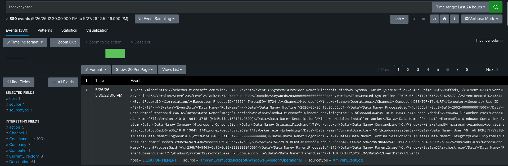
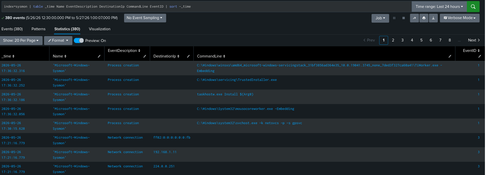
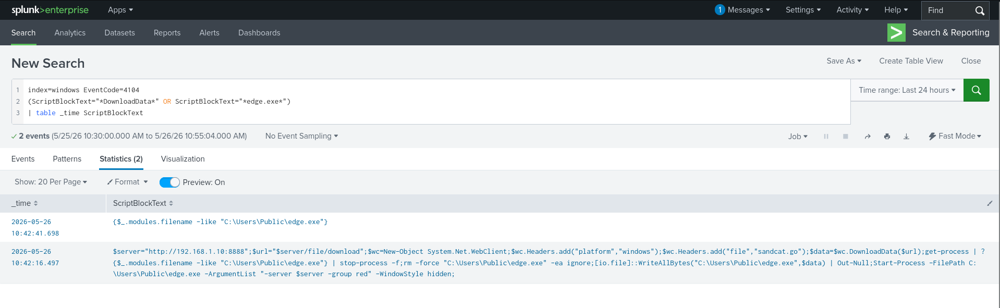

# Sysmon Telemetry Integration with Splunk

## Objective

Sysmon telemetry was integrated into Splunk SIEM to improve:
- endpoint visibility
- process monitoring
- detection engineering
- ATT&CK-based investigations

---

## Components

| Component | Purpose |
|---|---|
| Sysmon | Endpoint telemetry |
| Splunk Universal Forwarder | Log forwarding |
| Splunk Enterprise | SIEM platform |

---

## Sysmon Event Channel

```text
Microsoft-Windows-Sysmon/Operational
```

---

## Splunk Forwarder Configuration

### inputs.conf

```ini
[WinEventLog://Microsoft-Windows-Sysmon/Operational]
disabled = 0
index = sysmon
renderXml = true
sourcetype = XmlWinEventLog:Microsoft-Windows-Sysmon/Operational
start_from = oldest
current_only = 0
checkpointInterval = 5
```

---

## Verification Commands

### Verify Sysmon Service

```powershell
sc query Sysmon64
```

---

### Verify Forwarder Inputs

```powershell
splunk btool inputs list WinEventLog --debug
```

---

## Example SPL Queries

### Process Creation

```spl
index=sysmon EventCode=1
| table _time Image CommandLine ParentImage User
```

---

### Network Connections

```spl
index=sysmon EventCode=3
| table _time Image DestinationIp DestinationPort
```

---

### PowerShell Execution

```spl
index=sysmon EventCode=1
Image="*powershell.exe*"
```

---

## Telemetry Benefits

Sysmon integration enabled:
- process tree analysis
- PowerShell monitoring
- network connection visibility
- ATT&CK detection mapping
- parent-child process correlation

---

## Key Event IDs

| Event ID | Description |
|---|---|
| 1 | Process Creation |
| 3 | Network Connections |
| 7 | Image Load |
| 11 | File Creation |
| 13 | Registry Modification |

---

## Screenshots

### Sysmon Events in Splunk



---



---

### PowerShell Telemetry

